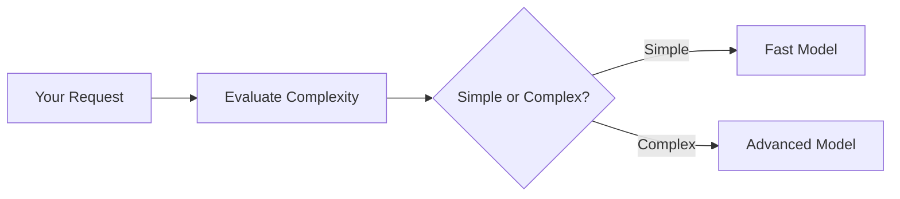

# Family Model Routing

**Intelligent routing between AI models based on task complexity.**

Family Model Routing automatically selects the optimal AI model for your request. Simple tasks use faster, cost-effective models while complex tasks get routed to more powerful models.

## How it works

The system evaluates your task complexity and routes to the appropriate model:

## Available Families

### Anthropic Claude
**Best for general-purpose tasks and balanced reasoning**

| Task Complexity | Model Used |
|-----------------|------------|
| Simple (1-50) | Claude 3.5 Haiku |
| Complex (51-100) | Claude 4 Sonnet |

### DeepSeek
**Optimal for advanced reasoning tasks**

| Task Complexity | Model Used |
|-----------------|------------|
| Standard (1-60) | DeepSeek V3 |
| Complex (61-100) | DeepSeek R1 |

### Google Gemini
**Latest AI capabilities with three-tier routing**

| Task Complexity | Model Used |
|-----------------|------------|
| Fast (1-50) | Gemini 2.5 Flash Lite |
| Balanced (51-70) | Gemini 2.5 Flash |
| Expert (71-100) | Gemini 2.5 Pro |

### Meta Llama
**Open-source excellence with Scout technology**

| Task Complexity | Model Used |
|-----------------|------------|
| Standard (1-60) | Llama 4 Scout 17B |
| Complex (61-100) | Llama 4 Maverick 17B |

### OpenAI GPT
**Cutting-edge reasoning with O3 model**

| Task Complexity | Model Used |
|-----------------|------------|
| Standard (1-40) | GPT-4.1 Mini |
| Advanced (41-75) | GPT-4.1 |
| Expert (76-100) | O3 |

> For the complete list of family IDs and models, visit [makehub.ai/models](https://makehub.ai/models)
